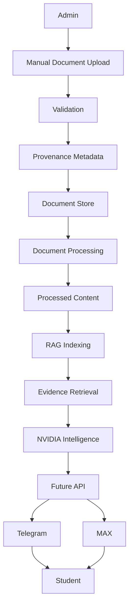
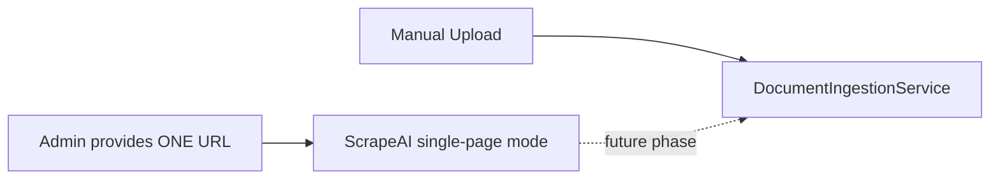

# UniAssist

UniAssist is a university knowledge assistant built on a **controlled, verified document corpus**. Administrators manually upload authoritative university documents; the system preserves provenance and verification state so answers can be grounded in trusted evidence.

UniAssist v1 does **not** depend on website crawling.

## Product vision

The goal is not to crawl everything and let AI decide what matters. The goal is to give UniAssist a curated set of authoritative documents and make the AI answer only from verified evidence.

## Architecture (v1)



### Future optional acquisition path

ScrapeAI remains in the repository as a **reusable, optional** acquisition component. It is not part of UniAssist v1.



**UniAssist v1 does not crawl the SUSU website.**

## Document lifecycle

```
UPLOAD
  ↓
DRAFT + PENDING
  ↓
future admin / NVIDIA verification
  ↓
VERIFIED
  ↓
ACTIVE
```

New uploads default to `draft` + `pending`. A document becomes `active` only through explicit activation (Phase 3 CLI: `activate`).

## What is ScrapeAI?

ScrapeAI ([`src/uniassist/scrapeai/`](src/uniassist/scrapeai/)) is a reusable Scrapy-based acquisition engine. It is **frozen** and optional — useful for future projects or controlled single-page imports, but not required for UniAssist v1.

## Directory layout

```
Uniassist/
├── configs/susu/              # frozen SUSU connector config (optional acquisition)
├── data/
│   ├── raw/                   # immutable uploaded document blobs
│   ├── processed/             # derived normalized content (Phase 4)
│   └── metadata/
│       ├── documents.json     # corpus index
│       ├── processing.json    # processing results index
│       └── rag/               # vector index + indexing metadata
├── src/uniassist/
│   ├── core/                  # shared utilities (hashing)
│   ├── documents/             # v1 ingestion + store
│   ├── processing/            # document processing (MinerU, text)
│   ├── rag/                   # chunking, embeddings, retrieval
│   ├── ai/                    # NVIDIA answer generation + verification
│   ├── api/                   # FastAPI application layer (Phase 7)
│   └── scrapeai/              # optional acquisition (frozen)
├── frontend/                  # React admin dashboard (Phase 8)
└── tests/
```

## Development phases

| Phase | Description | Status |
|-------|-------------|--------|
| 0 | Project foundation | Done |
| 1 | ScrapeAI acquisition engine | Done (frozen) |
| 2 | SUSU connector (optional) | Done (frozen) |
| 3 | Document ingestion + provenance store | Done |
| 4 | MinerU document processing | Done |
| 5 | RAG evidence retrieval foundation | Done |
| 6 | NVIDIA answer generation + verification | Done |
| 6.5 | Intelligence quality + verification hardening | Done |
| 7 | FastAPI application API | Done |
| 8 | Admin document UI | Done |
| 9 | Telegram bot | Done |
| 10 | MAX integration | Not started |

## Getting started

Requires Python 3.11 or newer.

```bash
python3 -m venv .venv
source .venv/bin/activate
pip install -e ".[dev]"
```

### Upload a document

```bash
python -m uniassist.documents.cli upload path/to/rules.pdf \
  --title "Student Rules" \
  --source "SUSU regulations office" \
  --effective-date 2025-09-01 \
  --version "2025-1"
```

### List and inspect

```bash
python -m uniassist.documents.cli list
python -m uniassist.documents.cli show <document_id>
```

### Activate after review

```bash
python -m uniassist.documents.cli activate <document_id>
```

### Process an approved document

Only `active` + `verified` documents are processed in the production workflow.

```bash
python -m uniassist.processing.cli process <document_id>
python -m uniassist.processing.cli show <document_id>
python -m uniassist.processing.cli list
```

**Raw documents are immutable.** Files in `data/raw/` are never modified. Processed output in `data/processed/{document_id}/{source_sha256}/` is a derived artifact. The original source document and `DocumentRecord` remain authoritative for provenance.

#### Processing routing

| Source type | Processor | Notes |
|-------------|-----------|-------|
| PDF | MinerU | Requires `mineru` CLI (`pip install 'mineru[pipeline]'`, Python >=3.10,<3.14) |
| TXT | TextProcessor | Direct UTF-8 extraction, no MinerU |
| DOCX | Deferred | Unsupported until MinerU advertises reliable DOCX support |

#### Normalized output format

`data/processed/{document_id}/{source_sha256}/normalized.json`:

```json
{
  "document_id": "...",
  "title": "...",
  "source": "...",
  "source_url": "...",
  "source_sha256": "...",
  "processor": "text",
  "processor_version": "1.0.0",
  "processed_at": "2026-01-01T00:00:00+00:00",
  "blocks": [
    {"text": "...", "page_number": 1, "section": "paragraph_1"}
  ]
}
```

Provenance chain:

```
Answer → RetrievedChunk → normalized content → DocumentRecord → raw document → source
```

### Index and search evidence (Phase 5)

**Phase 5 retrieves evidence but does not generate answers.**

Only `active` + `verified` documents with completed processing are indexed.

```bash
# Index all eligible processed documents
python -m uniassist.rag.cli index

# Index one document
python -m uniassist.rag.cli index <document_id>

# Search for evidence
python -m uniassist.rag.cli search "How do I request academic leave?"

# Index statistics
python -m uniassist.rag.cli stats
```

#### RAG architecture

```mermaid
flowchart TD
    Processed[data/processed/] --> Chunker[Chunker]
    Chunker --> Embed[EmbeddingProvider]
    Embed --> VectorStore[VectorStore]
    VectorStore --> Retriever[Retriever]
    Query[User Query] --> Retriever
    Retriever --> Evidence[RetrievedChunk[]]
```

1. **Processed documents** — normalized JSON from Phase 4
2. **Chunking** — deterministic, rule-based splitting with configurable size/overlap
3. **Embeddings** — provider abstraction (`DeterministicEmbeddingProvider` by default)
4. **Vector storage** — local JSON-backed store with cosine similarity
5. **Retrieval** — ranked `RetrievedChunk` results with full provenance
6. **Eligibility filtering** — DRAFT, PENDING, REJECTED, and ARCHIVED documents are excluded

Each `RetrievedChunk` preserves `document_id`, `chunk_id`, `source_sha256`, document version, source, source_url, page, section, and similarity score — everything needed for NVIDIA citation and verification.

### Ask a grounded question (Phase 6)

**Phase 6 generates and verifies answers from retrieved evidence. It does not replace the document corpus as the source of truth.**

Requires `NVIDIA_API_KEY` (see `.env.example`). Uses NVIDIA NIM OpenAI-compatible chat completions at `https://integrate.api.nvidia.com/v1`.

```bash
export NVIDIA_API_KEY=your_key_here

python -m uniassist.ai.cli ask "Can I take academic leave?"
python -m uniassist.ai.cli ask "Can I take academic leave?" --mock
```

Pipeline:

```
Question → Retriever → RetrievedChunk[] → NVIDIA → CandidateAnswer → VerificationEngine → VerifiedAnswer
```

- Answers are generated only from retrieved evidence
- Claims are verified individually
- Unsupported claims, invalid citations, and contradictions cause refusal
- DRAFT / PENDING / ARCHIVED documents are excluded from verification
- Retrieved document text is treated as data, not instructions (prompt-injection resistant prompts)

### Phase 6.5 — Intelligence quality (development vs production)

Phase 6.5 hardens retrieval and verification without changing the core architecture.

**Development mode** (tests, offline work):

- `DeterministicEmbeddingProvider` — hash-based local embeddings (`UNIASSIST_EMBEDDING_PROVIDER=deterministic`)
- `DeterministicSemanticVerifier` — keyword-overlap claim support checks
- No API keys required

**Production-quality path**:

- `NVIDIAEmbeddingProvider` — semantic embeddings via NVIDIA NIM `POST /v1/embeddings`
  - Default model: `nvidia/nv-embedqa-e5-v5` (override with `NVIDIA_EMBEDDING_MODEL`)
  - Selected because UniAssist already uses NVIDIA NIM for answer generation
- Vector index manifest tracks provider, model, and dimension — incompatible indexes require explicit rebuild
- Retrieval supports `min_score` thresholds and per-document diversity limits
- Layered verification: structural → evidence → citation → eligibility → semantic → contradiction
- Optional `NVIDIASemanticVerifier` when `UNIASSIST_USE_NVIDIA_VERIFIER=1`
- Model confidence is never treated as proof of evidence validity

```bash
export NVIDIA_API_KEY=your_key_here
export UNIASSIST_EMBEDDING_PROVIDER=nvidia

# Rebuild index after changing embedding provider/model
python -m uniassist.rag.cli rebuild

# Search with minimum similarity threshold
python -m uniassist.rag.cli search "academic leave" --min-score 0.35
```

**Refusal behavior**: UniAssist refuses when there is no relevant evidence, claims are unsupported, citations are invalid, or evidence conflicts across active documents. Out-of-domain questions must not be answered from model knowledge alone.

**NVIDIA integration test** (optional, not part of normal CI):

```bash
export UNIASSIST_RUN_NVIDIA_INTEGRATION=1
export NVIDIA_API_KEY=your_key_here
pytest tests/ai/test_nvidia_integration.py -v
```

### REST API (Phase 7)

Phase 7 exposes UniAssist through a thin FastAPI application layer. Routes delegate to existing services — no business logic is duplicated in the API package.

Start the development server:

```bash
uvicorn uniassist.api.app:create_app --factory --reload
```

Open interactive docs at [http://127.0.0.1:8000/docs](http://127.0.0.1:8000/docs).

**Endpoints**

| Method | Path | Description |
|--------|------|-------------|
| GET | `/health` | Simple health check |
| GET | `/status` | Safe system status (no secrets) |
| POST | `/ask` | Grounded question answering |
| POST | `/documents/upload` | Upload a document (multipart) |
| GET | `/documents` | List documents (optional filters) |
| GET | `/documents/{id}` | Document metadata + processing/index status |
| POST | `/documents/{id}/activate` | Activate a draft document |
| POST | `/documents/{id}/process` | Process an eligible document |
| POST | `/documents/{id}/index` | Index an ACTIVE + VERIFIED document |

**Example — ask a question**

```bash
curl -s http://127.0.0.1:8000/ask \
  -H 'Content-Type: application/json' \
  -d '{"question":"Can I take academic leave?"}'
```

**Example — upload a document**

```bash
curl -s http://127.0.0.1:8000/documents/upload \
  -F file=@rules.txt \
  -F title="Student Rules" \
  -F source="Admin upload"
```

**Environment variables**

| Variable | Purpose |
|----------|---------|
| `UNIASSIST_PROJECT_ROOT` | Project root containing `data/` (default: current directory) |
| `UNIASSIST_CORS_ORIGINS` | Comma-separated CORS allowlist (empty = disabled) |
| `UNIASSIST_MAX_QUESTION_LENGTH` | Maximum `/ask` question length (default: 2000) |
| `NVIDIA_API_KEY` | Required for live NVIDIA answers in production |

CORS is **not** enabled by default. Set `UNIASSIST_CORS_ORIGINS` explicitly for local frontends.

Every response includes an `X-Request-ID` header. Clients may supply their own with the `X-Request-ID` header (8–64 alphanumeric characters).

### Admin UI (Phase 8)

Phase 8 adds a local React admin dashboard in `frontend/` for the complete document-management workflow:

```text
UPLOAD → REVIEW → ACTIVATE → PROCESS → INDEX → VERIFY CURRENT STATE
```

**Development workflow**

Terminal 1 — API:

```bash
export UNIASSIST_CORS_ORIGINS=http://localhost:5173,http://127.0.0.1:5173
uvicorn uniassist.api.app:create_app --factory --host 127.0.0.1 --port 8001 --reload
```

Terminal 2 — Admin UI:

```bash
cd frontend
cp .env.example .env
npm install
npm run dev
```

Open [http://localhost:5173](http://localhost:5173).

The frontend reads `VITE_API_BASE_URL` from `frontend/.env` (default: `http://127.0.0.1:8001`). Restart `npm run dev` after changing frontend environment variables.

The UI consumes the Phase 7 API only. FastAPI remains the single source of truth for lifecycle, validation, and processing.

**Frontend commands**

```bash
cd frontend
npm run build
npm test
```

### Real NVIDIA NIM + Telegram end-to-end

UniAssist connects to an **already running** NVIDIA NIM instance using the OpenAI-compatible API. It does not download models or install GPU software.

**Port layout (avoid conflicts)**

| Service | URL |
| --- | --- |
| NVIDIA NIM | `http://127.0.0.1:8000/v1` |
| UniAssist FastAPI | `http://127.0.0.1:8001` |
| React admin (optional) | `http://localhost:5173` |

**1. Inspect local NVIDIA NIM**

```bash
curl http://127.0.0.1:8000/v1/models
```

If this fails, NVIDIA NIM is not running. Start your local NIM first, then copy the returned model IDs into your environment.

**2. Configure environment**

Copy `.env.example` to `.env` (`.env` is git-ignored) and set:

```bash
NVIDIA_BASE_URL=http://localhost:8000/v1
NVIDIA_CHAT_MODEL=<from /v1/models>
NVIDIA_EMBEDDING_MODEL=<from /v1/models>
UNIASSIST_EMBEDDING_PROVIDER=nvidia
UNIASSIST_USE_NVIDIA_VERIFIER=1
UNIASSIST_API_URL=http://127.0.0.1:8001
TELEGRAM_BOT_TOKEN=<your token>
```

For hosted NVIDIA instead of local NIM:

```bash
NVIDIA_BASE_URL=https://integrate.api.nvidia.com/v1
NVIDIA_API_KEY=<required for hosted API>
```

**3. Rebuild the vector index with NVIDIA embeddings**

After documents are uploaded, activated, and processed:

```bash
export UNIASSIST_EMBEDDING_PROVIDER=nvidia
python -m uniassist.rag.cli rebuild
```

This replaces any deterministic development index. Never mix embedding providers in one index.

**4. Run the full local stack**

Terminal 1 — NVIDIA NIM (already running on port 8000)

Terminal 2 — UniAssist API:

```bash
uvicorn uniassist.api.app:create_app --factory --host 127.0.0.1 --port 8001 --reload
```

Terminal 3 — Telegram bot:

```bash
python -m uniassist.telegram.bot
```

**Architecture**

```text
Telegram → FastAPI :8001 /ask → RAG → NVIDIA NIM :8000 → Verification → Telegram
```

Check safe NVIDIA status:

```bash
curl http://127.0.0.1:8001/status
```

**Optional live integration tests**

```bash
UNIASSIST_RUN_NVIDIA_INTEGRATION=1 pytest tests/ai/test_nvidia_integration.py -v
UNIASSIST_RUN_TELEGRAM_INTEGRATION=1 pytest tests/telegram/test_telegram_integration.py -v
```

Both skip automatically when the required services or credentials are unavailable.

### Phase 10 — End-to-end validation

Phase 10 adds offline-safe test hardening plus optional **real** NVIDIA/FastAPI validation.

**Default suite (offline, no external services):**

```bash
python -m pytest -v
ruff check src tests
```

Must show **0 failures** without NVIDIA, Telegram, internet, MinerU, or live ScrapeAI.

**Synthetic E2E corpus:** `tests/fixtures/e2e/` (4 university-style test documents, clearly marked as fixtures)

**Optional live NVIDIA E2E** (real embeddings, retrieval, pipeline, FastAPI — not mocked):

```bash
export UNIASSIST_RUN_NVIDIA_INTEGRATION=1
export NVIDIA_BASE_URL=http://localhost:8000/v1
export NVIDIA_CHAT_MODEL=<from /v1/models>
export NVIDIA_EMBEDDING_MODEL=<from /v1/models>
export UNIASSIST_EMBEDDING_PROVIDER=nvidia
pytest tests/e2e/test_real_nvidia_e2e.py tests/e2e/test_real_fastapi_e2e.py -v
```

Skips with a clear reason if NVIDIA NIM is not running.

**Optional live Telegram test** (calls `getMe` only, no user spam):

```bash
export UNIASSIST_RUN_TELEGRAM_INTEGRATION=1
export TELEGRAM_BOT_TOKEN="..."
pytest tests/telegram/test_telegram_integration.py -v
```

**Manual Telegram E2E** (requires real bot token):

```bash
# Terminal 1: FastAPI on :8001
# Terminal 2:
export TELEGRAM_BOT_TOKEN="..."
export UNIASSIST_API_URL=http://127.0.0.1:8001
python -m uniassist.telegram.bot
```

### Telegram student bot (Phase 9)

Phase 9 adds a production-structured Telegram client that consumes the existing FastAPI `/ask` endpoint only. The bot does **not** implement RAG, NVIDIA calls, verification, or document processing — it is a thin client boundary.

**Architecture**

```text
Telegram Student → Telegram Bot → FastAPI /ask → AnswerPipeline → Telegram Bot → Student
```

Future channels (for example MAX in Phase 10) should reuse the same `/ask` contract.

**Environment variables**

| Variable | Description |
| --- | --- |
| `TELEGRAM_BOT_TOKEN` | Telegram bot token (required to run the bot) |
| `UNIASSIST_API_URL` | Base URL for UniAssist API (example: `http://127.0.0.1:8001`) |
| `TELEGRAM_RATE_LIMIT_PER_MINUTE` | Per-user in-memory rate limit (default: 10) |
| `TELEGRAM_REQUEST_TIMEOUT_SECONDS` | FastAPI client timeout (default: 60) |
| `TELEGRAM_MAX_MESSAGE_LENGTH` | Telegram message split threshold (default: 4096) |
| `UNIASSIST_RUN_TELEGRAM_INTEGRATION` | Set to `1` to enable optional live Telegram integration tests |

**Bot startup (long polling)**

Terminal 1 — API:

```bash
export UNIASSIST_CORS_ORIGINS=http://localhost:5173
uvicorn uniassist.api.app:create_app --factory --host 127.0.0.1 --port 8001 --reload
```

Terminal 2 — Telegram bot:

```bash
export TELEGRAM_BOT_TOKEN="..."
export UNIASSIST_API_URL="http://127.0.0.1:8001"
python -m uniassist.telegram.bot
```

**Supported commands**

- `/start` — welcome message
- `/help` — usage and safety guidance
- `/status` — UniAssist online/offline via `/health`
- normal text — grounded question answering via `/ask`

**Rate limiting and privacy**

Rate limiting is an in-memory, per-user sliding window suitable for single-process Phase 9 deployment. It is not distributed and resets when the bot process restarts.

The bot stores only lightweight in-memory session metadata (`session_id`, `last_request_id`, timestamp) for operational tracing. It does not persist full Telegram message history. Logs avoid bot tokens, authorization headers, and full student messages.

**Development and testing**

Telegram tests mock the API client and Telegram update objects. CI does not require Telegram credentials or a live FastAPI server.

```bash
pytest tests/telegram -v
```

Optional live Telegram integration tests:

```bash
export TELEGRAM_BOT_TOKEN="..."
export UNIASSIST_RUN_TELEGRAM_INTEGRATION=1
pytest tests/telegram/test_telegram_integration.py -v
```

**Manual test plan**

1. Start the API and bot as shown above.
2. Send `/start`, `/help`, and `/status`.
3. Ask: `How can I apply for academic leave?`
4. Ask an unrelated question.
5. Ask a question with insufficient evidence and confirm grounded refusal.
6. Trigger a long answer and confirm safe splitting.
7. Send rapid repeated questions to trigger rate limiting.

Webhooks, Redis, and student document uploads are intentionally out of scope for Phase 9.

### Run tests

```bash
pytest -v
ruff check src tests
```

## License

Not yet specified.
